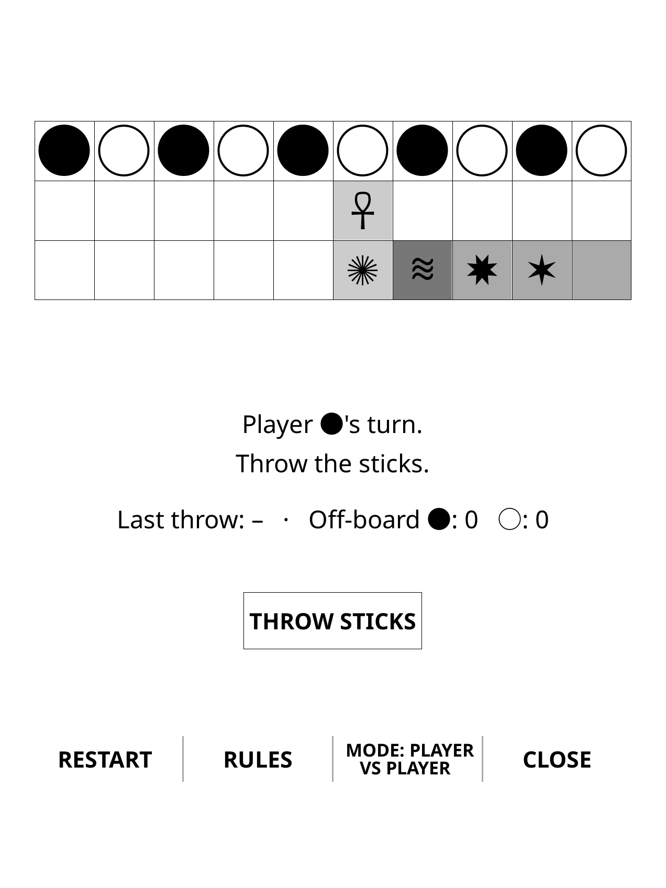
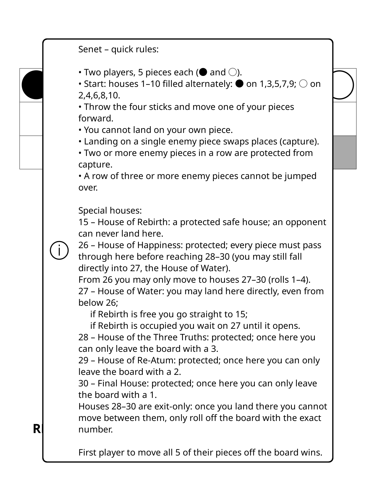

# 🐍 Senet for KOReader

An ancient Egyptian board game brought to [KOReader](https://github.com/koreader/koreader) – play Senet directly on your e-reader.

**Game**

- **Senet** – race game of the afterlife, adapted for KOReader.

**Modes**

- **Player vs Player**
- **Player vs AI – Easy**
- **Player vs AI – Normal**

## 📸 Screenshots

Main board and in-game rules running inside KOReader:

| Senet board | Rules / help screen |
| ----------- | ------------------- |
|  |  |

## 📦 Installation

1. **Download**
   - Go to the **Releases** page of this repository.
   - Download the latest `Source code (zip)` archive (or the dedicated plugin zip if provided).

2. **Extract**
   - Unzip the archive.
   - Locate the plugin folder, for example:
     - `senet.koplugin`

3. **Copy to KOReader plugins folder**

   Depending on your device, copy the `senet.koplugin` folder to one of the following:

   - **Kobo**  
     `/.adds/koreader/plugins/`

   - **Kindle**  
     `/mnt/us/koreader/plugins/`

   - **Other devices / generic**  
     `<koreader_folder>/plugins/`

   After copying, you should have something like:

   - `.../koreader/plugins/senet.koplugin/`

4. **Restart KOReader**
   - Safely disconnect your device (if connected via USB).
   - Restart KOReader so it can detect the new plugin.

## 🕹️ Usage

1. Open **KOReader**.
2. From the main menu, go to:
   - `Tools` → **Senet**  
     (or the section where KOReader lists user plugins on your build).
3. Choose your **mode**:
   - Player vs Player  
   - Player vs AI – Easy  
   - Player vs AI – Normal  
4. Play and enjoy (｡◕‿‿◕｡)

## 🗑️ Uninstall

To remove the plugin:

1. Exit KOReader.
2. Delete the `senet.koplugin` folder from your `plugins` directory.
3. Restart KOReader.

## 🛠️ Development

- Plugin folder: `senet.koplugin`
- Drop it into your local KOReader `plugins` directory and restart KOReader to test changes.
- If you’re working from a cloned repository, you can symlink or copy the folder into your KOReader `plugins/` path during development.

Feel free to open issues or pull requests if you find bugs or have suggestions.

## ⚖️ License

MIT License  

Copyright (c) 2025 chirheaux

Permission is hereby granted, free of charge, to any person obtaining a copy
of this software and associated documentation files (the "Software"), to deal
in the Software without restriction, including without limitation the rights
to use, copy, modify, merge, publish, distribute, sublicense, and/or sell
copies of the Software, and to permit persons to whom the Software is
furnished to do so, subject to the following conditions:

The above copyright notice and this permission notice shall be included in all
copies or substantial portions of the Software.

THE SOFTWARE IS PROVIDED "AS IS", WITHOUT WARRANTY OF ANY KIND, EXPRESS OR
IMPLIED, INCLUDING BUT NOT LIMITED TO THE WARRANTIES OF MERCHANTABILITY,
FITNESS FOR A PARTICULAR PURPOSE AND NONINFRINGEMENT. IN NO EVENT SHALL THE
AUTHORS OR COPYRIGHT HOLDERS BE LIABLE FOR ANY CLAIM, DAMAGES OR OTHER
LIABILITY, WHETHER IN AN ACTION OF CONTRACT, TORT OR OTHERWISE, ARISING FROM,
OUT OF OR IN CONNECTION WITH THE SOFTWARE OR THE USE OR OTHER DEALINGS IN THE
SOFTWARE.
